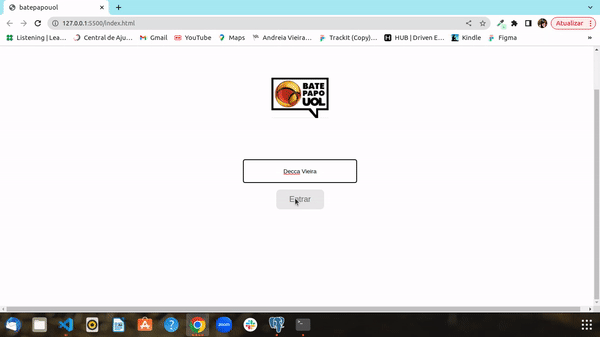

# Bate Papo Uol 

  <a href="#-tecnologias">Technologies</a>&nbsp;&nbsp;&nbsp;|&nbsp;&nbsp;&nbsp;
  <a href="#-projeto">Projects</a>&nbsp;&nbsp;&nbsp;|&nbsp;&nbsp;&nbsp;

## 🚀 Technologies

This project was developed with the following technologies:

- JavaScript
- CSS
- HTML

## 💻 Project

This project was inspired by a popular chat site!

## How to use?

1. Clone this repository with command 
git clone https://github.com/DeccaVieira/projeto5-batepapouol.git

2. open the terminal and type the command  
cd projeto5-batepapouol 
code .

3. open the folder 
index.html

4. Install the VsCode extension  
Live Server

5. Click Go live to run the project

## Decca Vieira
